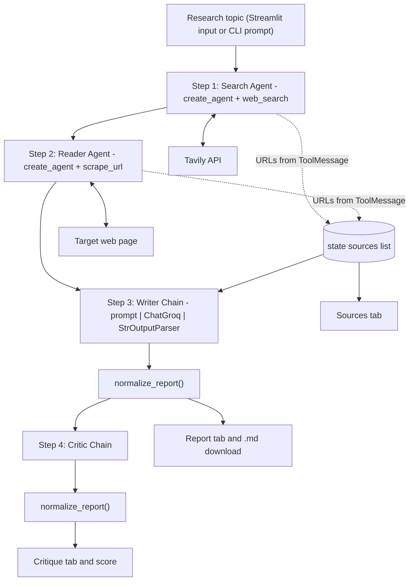
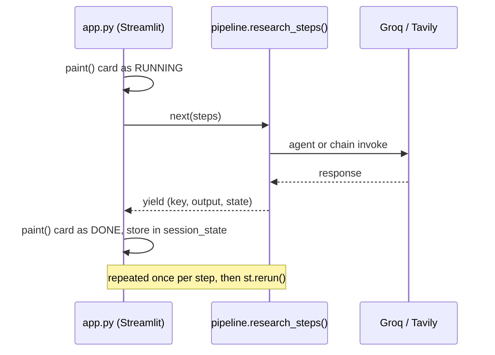

# ResearchMind – Multi-Agent AI Research System

A multi-agent research pipeline that searches the web, reads a source page, writes a cited report on any topic, and then critiques its own output.

---

## Overview

Researching an unfamiliar topic manually is a repetitive sequence of the same four tasks: find recent sources, read the most relevant one properly, synthesise the material into something structured, and then judge whether the result is any good. Each step is straightforward on its own, but doing all four takes time, and the quality depends on how disciplined you are about tracking where each claim came from.

ResearchMind automates that sequence. You give it a topic; it returns a structured Markdown report with an Introduction, Key Findings, a Conclusion and a Sources list, followed by a separate critique that scores the report out of 10 and lists concrete weaknesses.

**How this differs from a single LLM prompt:**

| Single LLM call | ResearchMind |
|---|---|
| Answers from training data, with a fixed knowledge cutoff | Retrieves live web results through the Tavily API at query time |
| Cites URLs it produces itself, which may not exist | Collects URLs from the actual tool responses and passes only those to the writer |
| Reads nothing; works from a search snippet at best | Fetches and extracts the text of a selected page with `requests` + BeautifulSoup |
| Self-assesses in the same breath as it answers | Runs a separate critic pass over the finished report |
| One opaque step | Four inspectable steps, each with its own prompt, output and UI state |

The system does not claim to verify individual claims. It constrains the writer to a set of URLs that were genuinely retrieved, which is a meaningful reduction in fabricated citations — not an elimination of hallucination.

---

## Key Features

Every feature below maps to code in this repository.

- **Search Agent** — a tool-calling agent (`langchain.agents.create_agent`) with access to a Tavily-backed `web_search` tool. Its system prompt limits it to at most two searches before summarising.
- **Reader Agent** — a second tool-calling agent with a `scrape_url` tool. It selects the single most relevant URL from the search step and fetches it once.
- **Writer Chain** — an LCEL chain (`prompt | ChatGroq | StrOutputParser`) that turns the gathered research plus the verified URL list into a structured report.
- **Critic Chain** — a second LCEL chain that reviews the finished report and returns a fixed-format assessment: a score out of 10, strengths, areas to improve, and a one-line verdict.
- **Source grounding from tool output** — `collect_source_urls()` extracts URLs from the agents' `ToolMessage` objects rather than from the model's prose, so the writer receives only URLs that a tool actually returned.
- **Web search** — Tavily, capped at 5 results with 300-character snippets.
- **Web page extraction** — `requests` with a browser user agent and an 8-second timeout, an HTTP status and content-type check, then BeautifulSoup text extraction with `script`, `style`, `nav` and `footer` elements stripped.
- **Markdown normalisation** — `normalize_report()` cleans model output before display: HTML line breaks become real Markdown lines, `•` becomes `-`, and tables with paragraph-sized cells are unrolled into readable subsections.
- **Token budgeting** — prompts are trimmed to fixed character budgets so requests stay under Groq's free-tier per-minute token limit.
- **Streamlit UI** — live per-step status cards, four result tabs (Report, Critique, Sources, Raw output), an extracted score display, and a Markdown download button.
- **CLI mode** — the same pipeline runs from the terminal via `python pipeline.py`.
- **Topic-agnostic** — nothing in the prompts or tools is domain-specific; the topic string is the only input.

---

## System Architecture

The pipeline is a Python generator, `research_steps()` in `pipeline.py`, that yields `(step_key, output, state)` after each stage completes. Both the Streamlit app and the CLI consume that same generator, so the orchestration logic exists in exactly one place.



### How the UI drives the pipeline



### Components

| Component | Responsibility | Input | Output |
|---|---|---|---|
| **Search Agent** (`build_search_agent()`) | Gather recent, reliable sources | Topic string | Prose summary of findings, plus `ToolMessage` records holding the raw Tavily results |
| **`web_search` tool** | Query Tavily | Search query | Up to 5 blocks of `Title / URL / Snippet` |
| **Reader Agent** (`build_reader_agent()`) | Read one source in depth | Topic + first 800 characters of the search summary | Key-facts summary, plus a `ToolMessage` holding the page text |
| **`scrape_url` tool** | Extract page text | A URL | Up to 3000 characters of cleaned text, or an explanatory error string |
| **`collect_source_urls()`** | Recover the URLs that were actually retrieved | An agent result | De-duplicated, order-preserving list of URLs |
| **Writer Chain** | Draft the report | Topic, trimmed search + scrape content, verified URL list | Markdown report |
| **`normalize_report()`** | Make model Markdown renderable | Raw model Markdown | Cleaned Markdown |
| **Critic Chain** | Assess the report | The cleaned report | `Score: X/10`, strengths, improvements, verdict |
| **`research_steps()`** | Orchestrate and hold state | Topic string | Yields `(key, output, state)` four times |

The shared `state` dictionary carries `topic`, `sources`, `search_results`, `scraped_content`, `report` and `feedback` between steps.

---

## How It Works

What happens after you submit a topic:

1. **The UI resets and reruns.** `app.py` clears previous results, sets `running=True` and calls `st.rerun()`, which disables the input and starts the pipeline on the next pass.
2. **Step 1 — Search.** `build_search_agent()` creates a tool-calling agent over `ChatGroq`. It is asked to find recent, reliable information about the topic and calls `web_search` (at most twice, per its system prompt). Tavily returns up to 5 results, each trimmed to a 300-character snippet.
3. **Sources are harvested.** `collect_source_urls()` walks the agent's message history, keeps only `ToolMessage` objects, and regex-extracts every URL. This is deliberate: the agent's final summary may paraphrase or omit links, but the tool output is a faithful record of what was retrieved.
4. **Step 2 — Read.** `build_reader_agent()` receives the topic plus the first 800 characters of the search summary, and is instructed to pick the single most relevant URL and call `scrape_url` exactly once. The tool checks the HTTP status and content type, removes `script`, `style`, `nav` and `footer` elements, and returns up to 3000 characters of text. Any new URLs in its tool output are appended to `state["sources"]`.
5. **Step 3 — Write.** The search summary and the scraped text are trimmed to 6000 characters each and concatenated, then passed to `writer_chain` together with the verified URL list. The prompt fixes the report structure (Introduction, Key Findings with at least three points, Conclusion, Sources) and constrains formatting to plain Markdown. The result passes through `normalize_report()`.
6. **Step 4 — Critique.** The cleaned report, trimmed to 12000 characters, goes to `critic_chain`, which must respond in a fixed format beginning with `Score: X/10`. That output is normalised too.
7. **Rendering.** After each `yield`, the UI repaints the step card and stores the output in `st.session_state`. When all four steps finish, the results appear in four tabs. `app.py` regex-extracts the score for the large numeric display, renders source URLs as HTML-escaped links, and offers the report as a `.md` download.

Errors at any step are caught, the failing card turns red, and the message is shown; `413` and `rate_limit` errors get an extra hint about the free-tier token limit.

---

## Technologies Used

| Technology | Purpose |
|---|---|
| **Python 3.10+** | Runtime (developed on 3.12) |
| **LangChain** (`langchain`, `langchain-core`) | `create_agent` for the tool-calling agents; `ChatPromptTemplate`, LCEL piping and `StrOutputParser` for the writer and critic chains; the `@tool` decorator for tool definitions |
| **langchain-groq** (`ChatGroq`) | Chat model interface to Groq |
| **Groq API** | LLM inference. Default model `openai/gpt-oss-120b`, with `temperature=0`, `max_tokens=2000`, `max_retries=6` and `reasoning_format="hidden"` |
| **Tavily** (`tavily-python`) | Web search API behind the `web_search` tool |
| **requests** | HTTP fetching in `scrape_url`, with timeout, custom user agent and status check |
| **BeautifulSoup4** | HTML parsing and text extraction |
| **Streamlit** | Web UI, session state, live step cards, tabs and download button |
| **python-dotenv** | Loads API keys from `.env` |
| **Standard library** (`re`, `html`, `time`, `sys`) | URL extraction, Markdown normalisation, HTML escaping, CLI encoding fixes |

> `requirements.txt` additionally pins several libraries that the current modules do not import (`pandas`, `tiktoken`, `rich`, `tenacity`, `orjson`, `aiohttp`, `lxml`, `html5lib`, `langchain-community`, `pydantic`). They are installed but unused; the table above lists only what the code actually depends on.

---

## Project Structure

```text
Multi-Agent-AI-Research-system/
│
├── app.py              Streamlit interface: custom CSS, live step cards,
│                       result tabs, score extraction, .md download
├── pipeline.py         research_steps() generator (the four steps and the
│                       shared state) plus the command-line entry point
├── agents.py           ChatGroq setup, the two tool-calling agents, the
│                       writer/critic prompts and chains, trim(),
│                       collect_source_urls()
├── formatting.py       normalize_report(): converts model Markdown into
│                       Markdown that renders correctly
├── tools.py            @tool definitions: web_search (Tavily) and
│                       scrape_url (requests + BeautifulSoup)
├── requirements.txt    Python dependencies
├── .env.example        Template for the required API keys
├── .gitignore          Excludes .env, .venv, __pycache__, editor files
└── README.md
```

| File | Responsibility |
|---|---|
| `app.py` | Presentation only. Holds no research logic; it drives the generator and renders state. |
| `pipeline.py` | Orchestration. Defines step order, threads the shared `state`, and provides the CLI. |
| `agents.py` | Model configuration, agent construction, prompt templates and text budgeting. |
| `tools.py` | External I/O. The only module that talks to Tavily or fetches web pages. |
| `formatting.py` | Pure text transformation, with no dependencies beyond `re`. |

---

## Installation

**Prerequisites:** Python 3.10 or newer, and a Groq and a Tavily API key (both have free tiers).

```bash
git clone <repository-url>
cd <project-directory>
python -m venv .venv
```

Activate the virtual environment.

PowerShell (Windows):

```powershell
.\.venv\Scripts\Activate.ps1
```

Command Prompt (Windows):

```bat
.venv\Scripts\activate.bat
```

macOS / Linux:

```bash
source .venv/bin/activate
```

Then install the dependencies:

```bash
pip install -r requirements.txt
```

> If PowerShell blocks the activation script, run
> `Set-ExecutionPolicy -Scope Process -ExecutionPolicy Bypass` in that session first.

---

## Environment Variables

Copy `.env.example` to `.env` and fill in your keys:

```env
GROQ_API_KEY=your_key_here
TAVILY_API_KEY=your_key_here
# Optional - defaults to openai/gpt-oss-120b
# GROQ_MODEL=openai/gpt-oss-20b
```

| Variable | Required | Read by | Notes |
|---|---|---|---|
| `GROQ_API_KEY` | Yes | `ChatGroq` in `agents.py` | Free key from <https://console.groq.com/keys>. A missing key is not caught at import; it surfaces as an authentication error on the first model call. |
| `TAVILY_API_KEY` | Yes | `tools.py` | Free key from <https://app.tavily.com/home>. Validated at import — a missing key raises `RuntimeError: TAVILY_API_KEY is not set` immediately. |
| `GROQ_MODEL` | No | `agents.py` | Overrides the default `openai/gpt-oss-120b`. |

**Secrets must not be committed.** `.gitignore` already excludes `.env` and `.env.*` (while keeping `.env.example`) as well as `.streamlit/secrets.toml`. If you deploy to Streamlit Community Cloud, supply the same two keys under **Settings → Secrets** rather than uploading a `.env` file.

---

## Running the Application

**Web interface:**

```bash
streamlit run app.py
```

Streamlit serves the app at `http://localhost:8501`. The workflow is:

1. Type a topic into the **Research Topic** field, or click one of the example chips.
2. Press **Run Research Pipeline**. The input is disabled while the run is in progress.
3. Watch the four pipeline cards move through `WAITING → RUNNING → DONE`. A failed step turns red and the error is shown below.
4. Read the results in the tabs:
   - **Report** — the final Markdown report, with a button to download it as a `.md` file.
   - **Critique** — the extracted score shown prominently, followed by the full critique.
   - **Sources** — every URL collected from tool output, as clickable links.
   - **Raw output** — collapsible panels with the unedited Search and Reader agent responses, useful for debugging.

**Command line:**

```bash
python pipeline.py
```

You are prompted for a topic, and each step prints its heading before it runs, followed by its output. The number of sources found is printed after the search step. Standard output is reconfigured to UTF-8, because Windows consoles default to cp1252 and cannot encode characters the model commonly emits.

---

## Example Usage

**Input topic:** `Fusion energy progress`

**What the run produces:**

- *Search step* — a summary of recent fusion coverage, plus the URLs collected from the Tavily response.
- *Reader step* — key facts extracted from one of those pages.
- *Report* — Markdown following the structure the prompt enforces:

```markdown
## Introduction
...

## Key Findings

### Finding 1 - <short title>
<paragraph of analysis>

- <supporting evidence with an inline citation such as (Publisher, 4 Mar 2026)>
- <supporting evidence>

### Finding 2 - <short title>
...

## Conclusion
...

## Sources
- https://example.com/article-one
- https://example.com/article-two
```

- *Critique* — the fixed format the critic prompt specifies:

```text
Score: 7/10

Strengths:
- ...

Areas to Improve:
- ...

One line verdict:
...
```

The headings and structure above are enforced by the prompts; the wording, findings and score vary per run and per topic. The URLs under Sources are those returned by the tools during that specific run.

---

## Multi-Agent Design

The work is split across four LLM invocations instead of one, and that split is visible in `pipeline.py`.

**Separation of responsibilities**

| Stage | Type | Why it is separate |
|---|---|---|
| Search | Tool-calling agent | Needs to decide *what* to query and when to stop; its system prompt caps the loop at two searches |
| Read | Tool-calling agent | A different decision — *which* single URL is worth fetching — with a different tool and a much smaller context |
| Write | Deterministic chain | Needs no tools. It transforms gathered text into a fixed structure, so an agent loop would add cost and variance for nothing |
| Critique | Deterministic chain | Judging output is a different task from producing it, and a separate call means the critic sees the finished report rather than its own reasoning |

**What this buys, in terms of the actual code:**

- **Modularity** — each stage has its own prompt and its own budget. Changing the report structure means editing `writer_prompt`; changing search behaviour means editing one system prompt. Neither touches the other.
- **Debugging** — every step's output is stored in `state` and surfaced in the UI. When a report is weak, the Raw output tab shows whether the search returned poor sources or the writer misused good ones.
- **Reliability** — smaller, single-purpose prompts fit within the free-tier token budget, and a failure is attributable to a specific step rather than to one large opaque call.
- **Extensibility** — `STEPS` in `pipeline.py` and the generator's yields are the only contract between the pipeline and the UI, so adding a stage means adding a tuple and a `yield`.

---

## Hallucination / Source Grounding

How sources move through the system:

1. **Obtained** — `web_search` calls Tavily and returns `Title / URL / Snippet` blocks. These are real search results, not model output.
2. **Extracted** — `scrape_url` fetches one page over HTTP. It calls `raise_for_status()` so a 404 or 403 error page is never scraped and returned as if it were article content, and it rejects non-HTML content types.
3. **Recorded** — `collect_source_urls()` reads URLs out of `ToolMessage` objects only. The model's own prose is never parsed for URLs, so a fabricated link cannot enter the source list.
4. **Constrained** — the writer prompt injects that URL list under *"Verified Source URLs (cite only these, do not invent any others)"* and requires the Sources section to list them.
5. **Displayed** — the Sources tab renders `state["sources"]` directly, so what the user sees is the retrieval record, independent of what the report says.

**What this does and does not guarantee.** The citation *list* is grounded: every URL shown was returned by a tool. The *mapping between a specific claim and a specific URL* is not verified — the model is instructed to cite accurately, but nothing in the code checks that a given sentence is supported by the page it cites. The report may also contain claims from the model's own knowledge that were never in the retrieved material. Only one page is read in full per run, so much of the report rests on 300-character snippets. Treat the output as a well-sourced first draft, not as verified fact.

---

## Design Decisions

- **Agents for retrieval, chains for generation.** Search and reading require the model to choose actions, so they use `create_agent`. Writing and critiquing are deterministic transformations of text already gathered, so they use plain LCEL chains — cheaper, faster and more predictable.
- **URLs come from tool output, not from the model.** The single most important grounding decision, implemented in `collect_source_urls()`: the agent's final message is prose and may paraphrase or omit sources, so the tool output is the only reliable record of what was retrieved.
- **Explicit character budgets.** `SEARCH_CHAR_BUDGET` and `SCRAPE_CHAR_BUDGET` (6000 each), `MAX_RESULTS=5`, `SNIPPET_CHARS=300`, `SCRAPE_CHARS=3000`, and the 800-character search summary handed to the reader all exist because Groq's free tier allows 8000 tokens per minute and an oversized request returns a `413` that the SDK does not retry. Tool output is re-sent on every subsequent agent turn, which is why the tool-level caps are the most aggressive.
- **Hard caps on agent loops.** The system prompts limit the search agent to two calls and the reader to exactly one, bounding both cost and conversation length.
- **One pipeline, two front ends.** `research_steps()` is a generator rather than a function returning a final result, so the UI can repaint after each stage while the CLI simply iterates. No orchestration logic is duplicated.
- **Post-processing the model's Markdown.** Models reach for HTML line breaks inside wide tables, and `st.markdown` escapes raw HTML, so `<br>` would appear as literal text. The writer prompt forbids HTML and `normalize_report()` repairs whatever slips through, so the UI, the download and the terminal all show the same text.
- **HTTP hardening in `scrape_url`.** Status check, content-type check, 8-second timeout, browser user agent, and removal of `script`/`style`/`nav`/`footer` before text extraction — each prevents a specific class of junk from reaching the model.
- **Streamlit for the UI.** It keeps the interface in the same language and process as the pipeline, and `st.empty()` placeholders plus session state are enough to show live per-step progress without a separate frontend, websocket layer or job queue.
- **`temperature=0`.** Research summarisation favours consistency over creative variation.

---

## Limitations

- **External API dependency.** The system cannot run without valid Groq and Tavily keys, and it fails if either service is unavailable.
- **Free-tier rate limits.** Groq's free tier allows 8000 tokens per minute. Running several topics in quick succession can return `429 rate_limit_exceeded`; an oversized prompt returns `413`. The UI detects both and suggests waiting.
- **Shallow reading.** Exactly one page is scraped per run, truncated to 3000 characters. The rest of the report is built from five 300-character snippets.
- **No JavaScript rendering.** `requests` + BeautifulSoup retrieves server-rendered HTML only. Single-page applications, paywalls, bot-blocked sites and PDFs return little or no usable text; the tool reports this as `Could not scrape URL`, and the pipeline continues without that content.
- **Citations are not claim-verified.** As described above, the URLs are real but the claim-to-source mapping is unchecked.
- **Search quality bounds report quality.** The report cannot be better than the five results Tavily returns for the topic.
- **Sequential latency.** The four steps run one after another, each waiting on a network round trip.
- **LLM error remains possible.** `temperature=0` reduces variance but does not prevent incorrect statements, misattributed dates or misread scraped text.
- **No persistence.** Results live in Streamlit session state. Refreshing the browser or restarting the process discards them unless the report was downloaded.
- **No automated tests.** The repository contains no test suite.
- **Normalisation is heuristic.** `normalize_report()` uses thresholds (for example, a 120-character cell width) to decide when to unroll a table; an unusual but valid table could be restructured when it did not need to be.

---

## Future Improvements

These are ideas, not implemented functionality.

- **Source ranking and selection** — score search results by domain reputation, recency or relevance instead of relying on the reader agent's unaided choice.
- **Read more than one page** — scrape the top *n* results concurrently and give the writer several full sources rather than one.
- **Parallel execution** — run independent retrievals concurrently to cut end-to-end latency.
- **Citation verification** — a stage that checks each cited claim against the retrieved text and flags unsupported statements.
- **Revision loop** — feed the critic's "Areas to Improve" back into the writer for a second draft, using the score as a stopping condition.
- **Persistent research history** — store past runs (topic, report, sources, score) so they can be revisited and compared.
- **Observability and logging** — structured logs or tracing for per-step latency, token usage and failures.
- **Evaluation benchmarks** — a fixed topic set with rubric-based scoring, to measure the effect of prompt or model changes.
- **Additional agent roles** — a fact-checker, an outline planner, or a domain specialist selected by topic.
- **Caching** — memoise search and scrape results so repeated topics do not re-spend API quota.
- **Tests** — unit tests for `normalize_report()`, `collect_source_urls()` and `trim()`, all of which are pure functions and easy to cover.

---

## Learning / Technical Takeaways

This project demonstrates:

- **Multi-agent system design** — decomposing a task into stages with distinct responsibilities, and choosing deliberately between an autonomous agent loop and a deterministic chain for each.
- **LLM orchestration** — sequencing model calls around a shared state object, exposed as a generator so a UI and a CLI can consume the same pipeline differently.
- **Tool calling** — defining tools with LangChain's `@tool` decorator, writing docstrings that function as the model's tool specification, and constraining loops through system prompts.
- **Web information retrieval** — combining a search API with direct HTTP fetching and HTML-to-text extraction, including the defensive checks that keep error pages and binary content out of the context window.
- **Source grounding** — separating what a model *says* from what a tool *returned*, and threading the verified artefact through the prompt chain.
- **Prompt design** — fixed output structures, explicit formatting constraints, and negative instructions written in response to observed failure modes.
- **Working within hard constraints** — designing character budgets and call caps around a real tokens-per-minute limit rather than assuming unlimited context.
- **Modular architecture** — separating I/O (`tools.py`), model configuration (`agents.py`), orchestration (`pipeline.py`), text processing (`formatting.py`) and presentation (`app.py`) so each can change independently.
- **Handling non-deterministic output** — post-processing model text into a form the renderer can display, instead of trusting the model to obey formatting rules every time.

---

## License

This repository does not currently specify an open-source license. Without one, default copyright applies and no usage rights are granted. If you intend the project to be reusable, add a `LICENSE` file.
